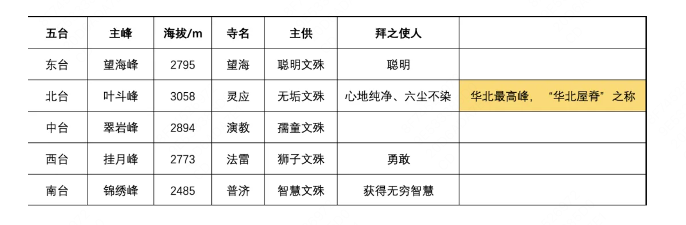
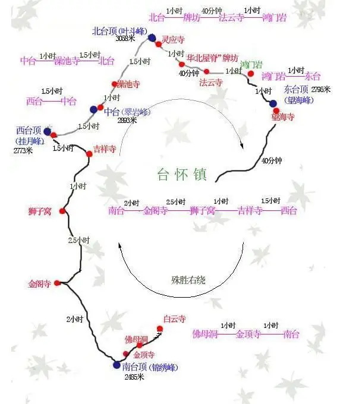
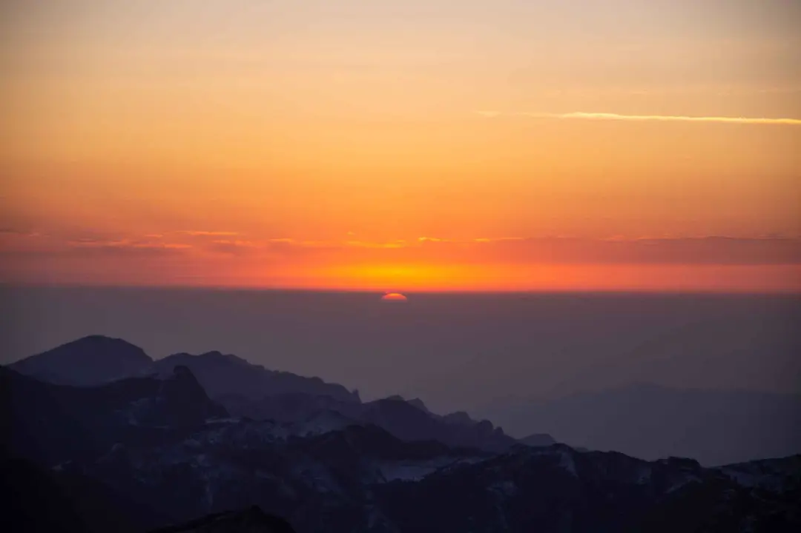
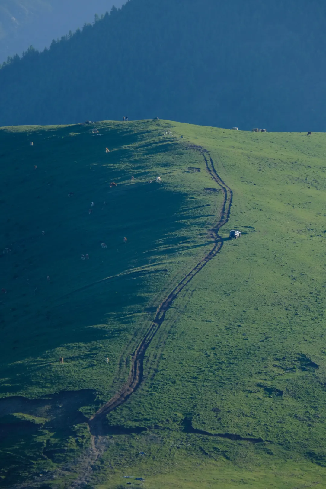
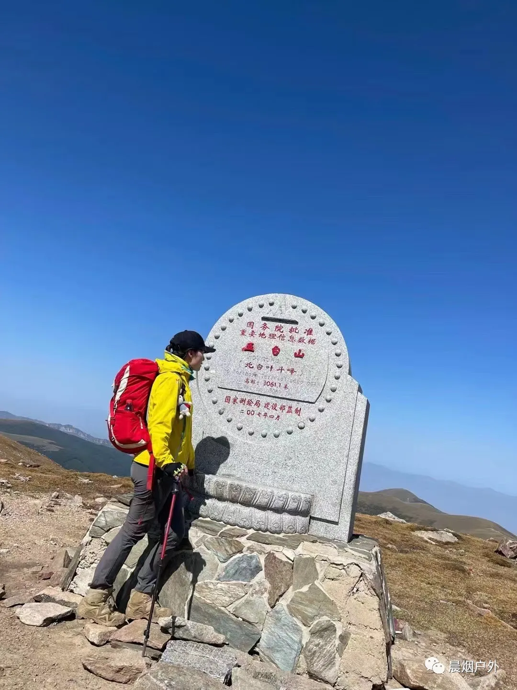
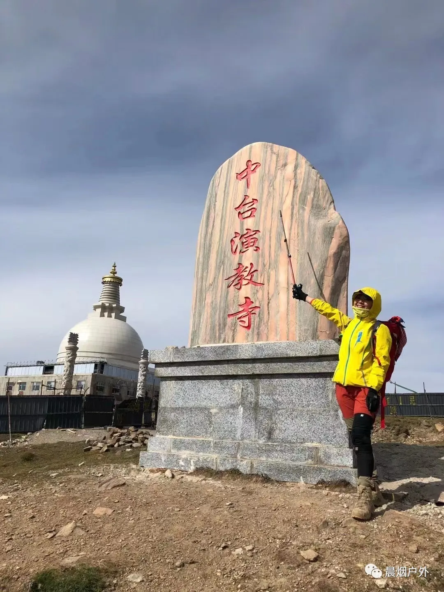
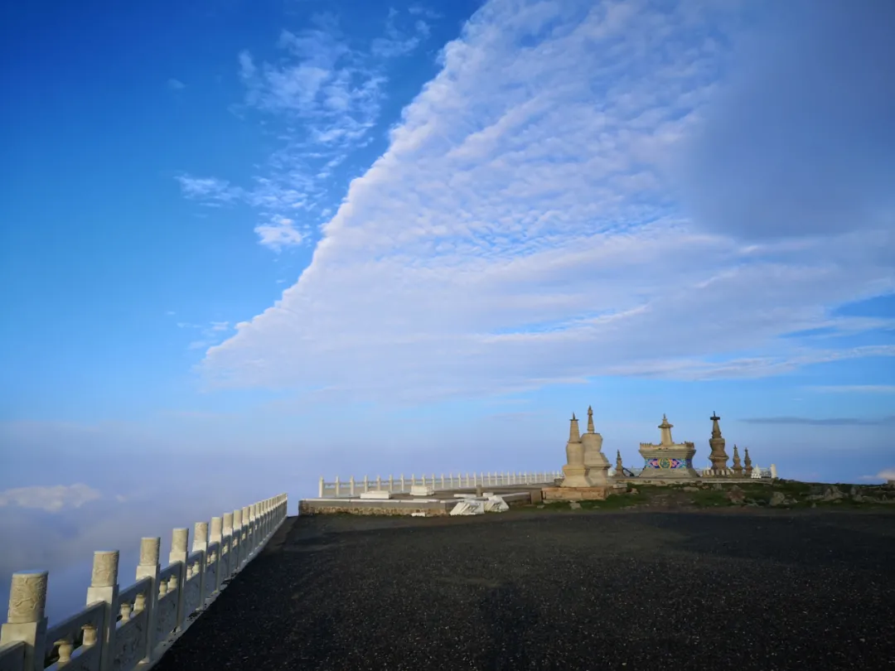
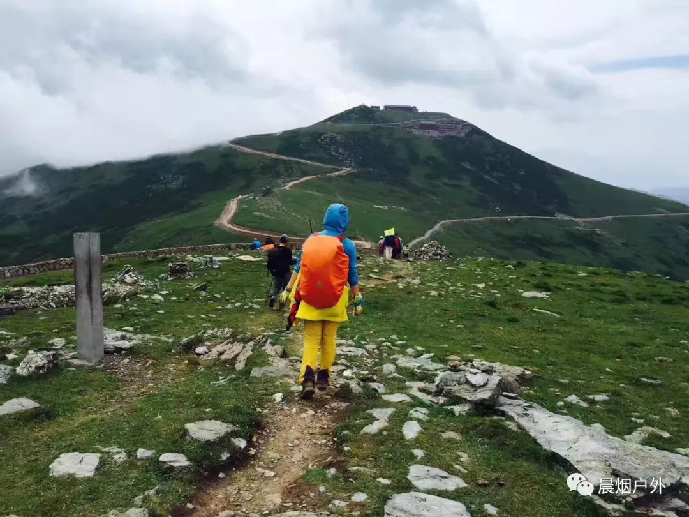
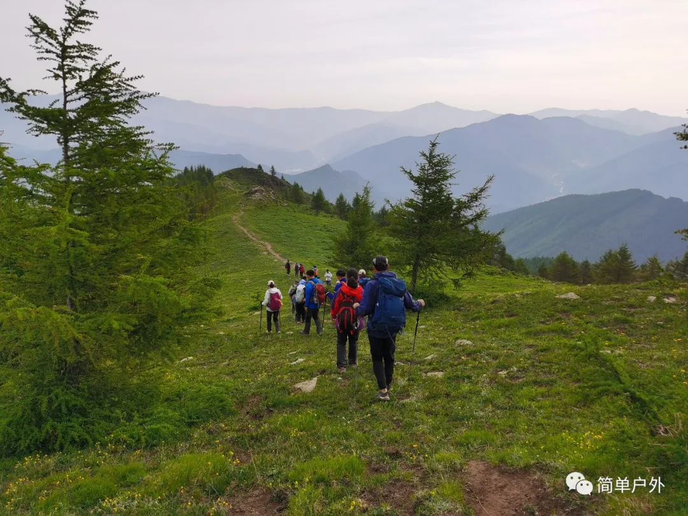
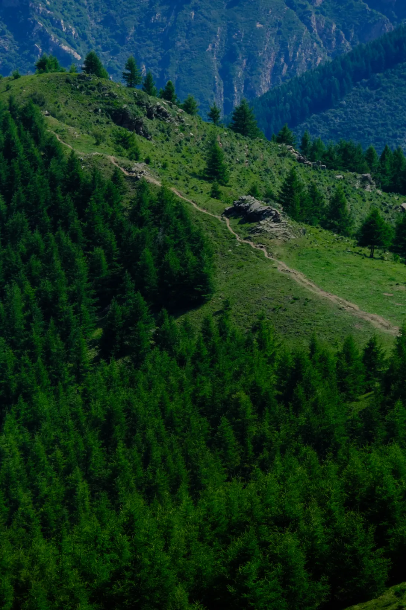

# 2024-05 Team Duer 首届五台山徒步

[TOC]

# 一 活动背景
## 背景

Team Duer 成立后在徒步方面还没有所建树，在超哥的带领下TeamDuer必须要在各个方向上补齐短板， 所以特地选取了一条北京驴友的经典路线朝圣五台山， 五台山，坐落在山西省忻州市五台县，与尼泊尔蓝毗尼园、印度鹿野苑、印度菩提伽耶、印度拘尸那迦，共称“世界五大佛教圣地”；与浙江普陀山、安徽九华山、四川峨眉山，共称“中国佛教四大名山”，是文殊菩萨的道场。之所以成为五台山，是因为它共有东、西、南、北、中五台，寺庙大大小小共有128座，许多人带着虔诚的心来朝拜这座神圣的佛山，祈求平安。
夏季的五台山
高山草甸、青石台阶
繁星满天、夕阳余晖
每一次去大五都有着不一样的经历，
每一次都有无法忘怀的记忆
大五，一个去了还想再去的地方
> 转山转水转佛塔
> 不为修来世
> 只为途中与你相见
> ——仓央嘉措

## 目的
通过这次五台山大朝台激发徒步热情，增加朋友之间的感情， 记录美好瞬间，留下念想，让超哥牛逼响彻五台山， 成为TeamDuer每年的保留项目。

## 目标
本次由于大部分人是第一次 环台，选取了简单点的一日逆穿， 大约50km， 在五个台大声喊超哥牛逼。

#二 整体流程
##  活动时间
*  5.10  晚上出京
*  5.12  下午回京

## 出行方式
  本次暂定自驾， 目前丙玉可以开车， 看人数还需要1-2辆， 到时候直接神州租车吧， 集合地点**待定 **
  司机人选
  - [x] 丙玉
  - [x] 超哥
  - [x] 浩南

> 去五台山三种途径：
1.  火车K601 晚上22:00 到早上 4:40 ， 优点便宜，灵活，  缺点下车直接开干的，睡不好有的人
2.  大巴， 可以报名户外团一起过去单独穿越一起回来， 一般周五晚上7:00 出发， 12-21点到， 睡觉3-4个小时， 开干， 优点： 可以休息休息， 缺点： 不够灵活，集合时间 回来时间都的和团保持一致
3.  自驾， 当前我可以开车， 我们人多的话的车不够， 优点：时间地点较为灵活， 比大巴速度更快到达，多休息休息， 缺点：司机的累点

## 行程安排（由于没和大家徒步过，不知道大家的体力情况，具体时间待定）
	1.  5.10 晚上 7-8点出发
	2.  5.10 晚上11-12点 到达 砂河镇
	3.  5.10 晚上 看情况决定需不需要撸串冲碳
	4.  5.10 宾馆休息4-5小时， 早上4-5点出发 打车去  鸿门岩(车程大概40min)
	5.  5.11 五点  鸿门岩出发开始正式徒步， 先爬东台， **东台吃斋饭**  然后返回鸿门宴
	6.  5.11 xx点。鸿门岩-法云寺-华北屋脊牌楼-北台-澡浴池， 在澡浴池 吃午饭（现金 or 扫码 20rmb）（走不动的，此处可下台怀镇， 不过作为TeamDuer的在这里下撤略丢脸建议在坚持下）
	7.  5.11 xx点 澡浴池-中台 - 西台 (这里有卖吃的， 下午通常有运营车可坐到金阁寺)-吉祥寺-狮子窝（这里也有商店、热水， 可以冲碳）
	8.  5.11 xx点 狮子窝-金阁寺-大南庄 （有农家乐可以冲碳）**** 如果在这里走不动了可以在这里住宿****
	9.  5.11 xx点 大南庄 -气象站-古南台（古南台可以不去也，不过这个寺庙的师傅挺不错的，上次还给了我一个火龙果）-南台-宽滩村（从南台到宽滩村可能晚上了，下坡较陡， 自己不要乱跑）
	10.  5.11 xx点 宽滩村有农家乐， 可以洗漱吃饭（如果下去还早的话。。。）
	11.  5.11 xx点坐车去台怀镇，住宿 冲碳
	12.  5.12  台怀镇游玩半天， 特别推荐 五爷庙很灵（升职加薪 赢娶白富美）
	13.  5.12 下午返回 砂河镇， 坐车回京
	14.  5.12 晚上七八点到京， 继续冲碳

> 几个小Tips
> 1. 五个台都可以拜拜
> 

> 2. 很多人第一次来， 不要走散， 五台山还听说最近有豹猫， 所以大家要在一起走，别乱跑
> 3. 遇到极端情况该怂还是得怂
> 4. 五台山有很多狐狸， 运气好还可以投喂，注意
> 

## 路线简介
本次选取的是逆穿路线：

1、鸿门岩，海拔2500米，距东台1.8KM，海拔上升246米（折返路线）
2、东台望海峰，台顶望海寺，海拔2796米
3、鸿门岩至法云寺，3.8KM，海拔上升59米
4、法云寺至华北屋脊牌坊，3.2KM，海拔上升299米
5、华北屋脊牌坊至北台顶，2.1KM，海拔上升203米
6、北台叶斗峰，台顶灵应寺，海拔3061米
7、北台顶至澡浴池，3KM，海拔下降295米
8、澡浴池，海拔2766米（此处可下台怀镇）
9、澡浴池至中台顶，2.5KM，海拔上升124米
10、中台翠岩峰，台顶演教寺，海拔2890米
11、中台至西台垭口牌楼，2.7KM，海拔下降261米
12、西台垭口牌楼海拔2629米（此处冬季无运营车）
13、西台垭口牌楼至西台顶，1KM，海拔上升144米
14、西台挂月峰，台顶法雷寺，海拔2773米
15、西台至吉祥寺，3.8KM，海拔下降423米
16、吉祥寺，海拔2347米
17、吉祥寺至狮子窝，4.6KM，海拔下降30米
18、狮子窝海拔2317米
19、狮子窝至金阁寺，5.6KM，海拔下降304米
20、金阁寺海拔2013米
21、金阁寺至大南庄，1.5KM，海拔下降30米（穿越住宿大南庄）
23、大南庄至气象站，3.2KM，海拔上升189米
24、气象站海拔2191米
25、气象站至南台顶，3.4KM，海拔上升283米
26、南台锦绣峰，台顶普济寺，海拔2474米
27、南台顶至宽滩村，2.8KM，海拔下降780米
28、宽滩村坐车回砂河镇 返京或者 台怀镇集合返京
五台山大朝台五台，全程约50KM。

# 三 装备要求 

*  证件：记得随身带上身份证！带点现金。
*  登山：登山鞋，冲锋衣/裤（没有可以考虑下迪卡侬或者软壳），登山杖，登山包（千万不能使用单肩背包或手提包）。
* 服装：雨衣必带，雪套（防雨防水 ）、手套，帽子，头巾及太阳镜 ， 备用厚些的衣物及替换衣物（超薄羽绒服 or 软壳、保暖内衣，夏季不用带太多），袜子两到三双备用。
* 装备：头灯必备，备用电池， 住宿条件不比宾馆，如有体力可带上洗漱用品。
* 设备：照相机，摄像机，手机，以上电器的充电器。
* 食品：高热量的路餐两顿（士力架、能量胶）。保暖水壶饮用水1升(必备)。ps：虽然路上都有卖水的吃的，但是为了防止极端情况需要做好兜底

# 四 五台简介
##  东台
东台名望海峰，海拔2795米，东台顶上“蒸云浴日，爽气澄秋，东望明霞，如陂似镜，即大海也，”故冠此名。由于海拔高，台顶气温低，盛夏时节，仍须穿棉衣。中国佛协前会长赵朴初填词赞曰：“东台顶，盛夏尚披裘。天著霞衣迎日出，峰腾云海作舟浮，朝气满神州。”

## 北台
北台名叶斗峰，海拔3061米，五台最高，有“华北屋脊”之称，其台“顶平广，圆周四里，其下仰视，巅摩斗杓，故以为名。”康熙皇帝赋诗赞曰：“绝磴摩群峭，高寒逼斗宫。钟鸣千嶂外，人语九霄中。朔雪晴犹积，春冰暖未融。凭虚看陆海，此地即方蓬。

## 中台

中台翠岩峰，海拔2894米，其台“顶广平，圆周五里，巅峦雄旷，翠霭浮空，因以为名。”有诗赞曰：“群峰面面拥奇观，朝雨和烟积翠峦。策杖千山浑不倦，披裘六月尚余寒。苍崖碧嶂周遭合，古木黄沙四望宽。云雾渐看山半起，却疑身已在云端。

## 西台
西台名挂月峰，海拔2773米，西台峰“顶广平，月坠峰巅，俨若悬镜，因以为名。”有诗赞曰：“西岭巍峨接远苍，回瞻乡国白云傍。孤峰岭翠连三晋，八水分流润四方。晴日野华铺蜀锦，秋风仙桂落天香。当年狮子曾遗迹，岩谷常浮五色光。”

## 南台
南台名锦绣峰，海拔2485米，此峰“顶若覆盂，圆周一里，山峰耸峭，烟光凝翠，细草杂花，千峦弥布，犹铺锦然，故以名焉。”著名诗人元好问赋诗赞曰：“沈沈龙穴贮云烟，百草千花雨露偏。佛土休将人境比，谁家随步得金莲？” 

